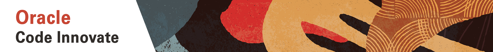

# Use Case Details:

**2-4-2020 Use Case email from Vertika:**

Hi Tom,

Below are the use cases we want to try at Code Innovate:

1. Master/One Bot:
There are multiple applications within MSI having their own chatbots. We want to build a common chatbot platform which can be used to access all these different chatbots.
For example: Through motbot (google chat) if users wish to invoke the Virtual Agent bot (Service now chatbot), the Virtual agent chat window should pop up on the motbot chat window for users to interact. Once they are done, they should be able to resume their conversation with motbot.

2. Expense Bot:
 We were demoed expense bot that ODA team had developed, where the users had options to create a new expense, change a saved expense, submit a new/saved expense and take action on the pending(submitted) expenses. We would want to add that too on our existing bot.

Let me know if you need any other details from our side.

Thanks,
Vertika

**2-3 Customer Use case email on OIC, VBCS, Process**

From: Santosh Jagilinki <santosh.jagilinki@motorolasolutions.com>
Date: February 2, 2020 at 12:59:51 AM EST
To: Becky Kadetz <BECKY.KADETZ@ORACLE.COM>, Thomas Burke <tom.burke@oracle.com>, Ben Burrus <ben.burrus@oracle.com>, Chris Parratt <chris.parratt@oracle.com>
Subject: Code Innovate use cases

Tom,

Would like to take a hypothetical use case for Code innovate program which may also include the pieces from our CDM project. 

UseCase: Customer Master approval and downstream integration with Oracle EBS system. 

Description: When CDM users create/update customer master records in FA, it has to go for approval through PCS embedded within CDM. Once approved data has to flow to custom objects within CDM and has to be published to integration that can sync data with our on-prem EBS system. Create a VBCS page to expose the custom objects records which can show the status of every individual transaction and ability to reprocess the data in case of failures. 

Objective: Showcase the capability of CDM, PCS, VBCS, ICS, Custom objects.

Additionally we may also plan to build BI reports to extract delta changes in a given and sync to DWH for reporting. 

I'm open to hear any other suggestions which may include more technical components from FA stack like App composer, Sandbox etc. Let me know your thoughts please.

Regards,
Santosh Jagilinki | Integrations Lead

Motorola Solutions, Inc. | motorolasolutions.com
M:+1.630.849.4828 | E: santosh.jagilinki@motorolasolutions.com

**3-2 call notes with Santosh and Mehul from Motorola (confirming details above).**

Customer Data Management: Santosh

Single system sync to all the downstream systems like EBS, etc. - to any systems that require master data
Tried this in the past - CDM must own data and flow data back to downstream
Any changes to master record done in CDM and any customer that is created or updated in CDM must go through an approval workflow and integrated with other systems.  Don't want customer updates done outside this process.
Need to build integrations to push data to other systems, and get reference ID from ERP system.
Also want VBCS page to show a list of records/history and have a form that shows status - if failed then have the ability to fix and re-process and push changes to downstream.
Do you have read access to CDM - have access, not sure if I have detailed access.
Would also like to have BI reports - extract deltas - more for reporting purposes.  Currently have AWS Redshift for historical data.  We could extract data from cloud and push data to DW. Not sure we would do that (more people involved).  Can we use something like ADW/BIP, etc. to create reports.
Question is there enough time to do this use case?
1-29 On call with customer, they mentioned the use case below for the event.

Router Bot -

Parses out and hands out to other bots to process based on need. Centralized bot engine to route to ther places. Oracle will be front, NLP.

**1-28 Santosh/Kushboo validated use cases they feel best to persue. (Yellow columns)**

Code_Innovate_Motorola_UseCase_Eval_Final.xlsx

**3-2 call notes with Santosh and Mehul from Motorola (confirming details above).**

Chat Bot/DA - Mehul - Two use cases

1. Landing bot consolidation of other bots, or have a funnel from google chat bot to others. PO retrieval, Salesforce..Current about 90 different commands, want to utilize what we have currently, but integrate the different bots/service areas. Have database of commands and rules, see what the user has access to, then select eg: sales - then based on that user can see sub-set of prompts. Bot responds with API call to retrieve info.

2. Improved conversational dialogue with user - current is very static. is just q and response. Want AI with more intel. Conversational with user. Want two way dialogue, and learn over time with user interactions. Future when have enough data have suggestions. Future proof tech.

**10-2 Call between Tom and Brian (motorola):**

Just wrapped up a quick call with Brian and he thinks that the following video aligns pretty closely with his OAC POC.  Can you take a quick look and let me know what you think?

Handling Manufacturing Delays - https://ipx.bcove.me?url=https%3A%2F%2Fwww.oracle.com%2Fcloud%2Fsolution-hubs%2Fdemos.html%3FvideoId%3D6027717658001&accountId=1460825906&experienceId=5c5c91e9144ee3001833c60a&videoId=6027717658001

Also, he would like to focus on predictive analytics around Inventory for his team’s Code Innovate use case.  He will be sending me a bit more info shortly.

**On 1/28/2020 5:59 PM, Ben Burrus wrote:**

Team,

We have started a POC on Supply Chain analytics.  This effort has 2 parts.  The first is to re-create an existing set of Redshift/Tableau dashboards using OAC & ADW (note: this is a very large dataset). 

The second part of the POC involves analyzing new csv data set of technical support/remedy cases and performing the following steps:

Load CSV performing any necessary cleansing to retain record alignment.   
Create a data exploration dashboard view (EG How cases what attributes break them down, cycle time measures, etc
Train Machine Learning Module to root cause cases (roughly ½ have been ‘human’ root caused).
Demonstrate model predictive capabilities based on human created root causes
text analytics on the comments
We are planning to (ultimately) execute this POC in MSI’s existing tenancy, but the 2nd use case can developed in any environment.  